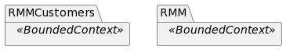
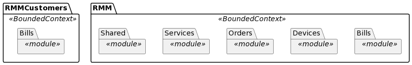
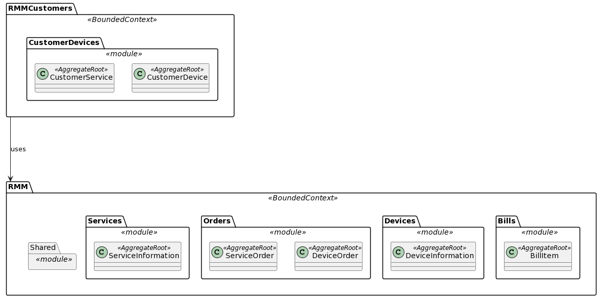
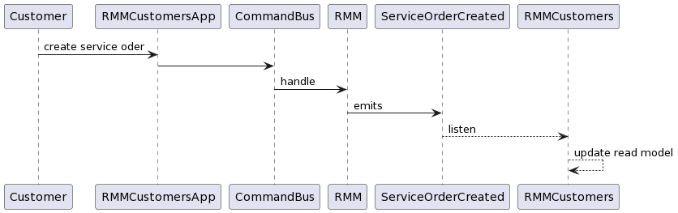

# NinjaRMM

NinjaRMM allows you to create a fleet of devices and associated services.
This application has been created using practices such as:

## Tactical DDD constructions

The project is organized using DDD concepts such as **Bounded Contexts** and **Modules**. There are two bounded contexts
RMMCustomers and RMM.

Each bounded context is divided in several modules containing different **Aggregate roots** representing the different
domain capabilities of the application.

## CQRS & EDA

The communication beetween modules and bounded contexts is done using a **Query bus** and an **Event bus**. As this applications
is in a mono ropo the differents bounded contexts could share some objects, for example RMMCustomers use several
events from RMM to update their **Read Model**.

Also there are two apps **rmm** and **rmmcustomers**, both are rest api's that dispatch **commands** or **querys** to
the RMM or RMMCustomers contexts.

For example, a customer could place an order for an existing device using rmmcustomers API and the API dispatch a command
to the RMM contenxt and then **Orders** module handle this command in order to fulfill the customer request.

## Idempotency

Every command (PUT requests to the API) send along the UUID identifier of the aggregate.
This favors the resolution of problems, for example of repeated/disordered events in case of a distributed infrastructure
using message brokers systems. It also allows using commands without returning a result, so the client doesn't have to wait
for the server to respond.

## Framework agnostic models

I have not used annotations in the model to avoid concerns about data persistence in the aggregates roots.
I have to say, however, that the development experience is affected by this decision, but not having the facility to use
Annotations like @OneToMany have allowed me to think more about AR modeling, in fact no join is used in the implementation of the solution.

## Testing

Three types of tests have been implemented:
- **Acceptance tests** They attack the application from the controllers
- **Unit tests**
  The entry points for these tests are the different command handlers and sometimes some more internal unit test if the logic is complex.
- **Infrastructure tests** Isolates the persistence components to test agains a real database.

Also, there are one special test 'TechincalTaskAcceptanceTest' that tests an aproximation of the scenario provided in the instructions.

# How to use the application

A Makefile has been provided to run the applications and their tests. There is a default configuration in the .env file
located in apps > main > resources.

In order to execute the tests the environment must be started with `make up`

- To execute all tests run: `make tests`
- To run the rmm-backend application run: `make run-rmm-backend`
- To run the rmm-customers application run: `make run-rmmcustomers-backend`

There is also an adminer services provided with docker-compose if you want to check for example the data on rmm-customers
context after a test suit execution.

